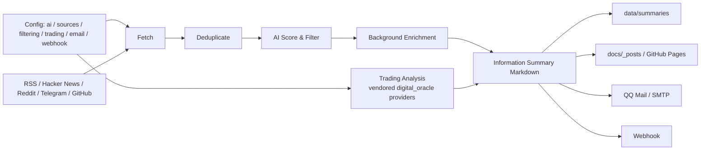

# Horizon

[](LICENSE)
[](https://github.com/astral-sh/uv)
[](https://github.com/shajieChen/Horizon/actions/workflows/daily-summary.yml)

面向个人信息流和交易观察的 AI 信息摘要系统。Horizon 会聚合多来源内容并生成每日 **Information Summary**。报告同时附带基于 digital_oracle provider 的 **Trading Analysis**。

> 免责声明： Trading Analysis 只用于信息整理和概率观察，不构成投资建议。市场存在不确定性，请独立判断并承担相应风险。

## 当前输出内容

Horizon 当前每天会生成一份 Markdown 报告，默认包含两部分：

### 1. Information Summary

来自配置源的信息摘要：

- RSS / Atom
- Hacker News
- Reddit
- Telegram public channel
- GitHub user events / repo releases

处理流程包括：

- AI 评分与筛选
- 跨来源去重
- 背景知识增强
- 重要内容的摘要、标签和引用整理
- 中文 / 英文摘要输出，具体语言由 `ai.languages` 决定

### 2. Trading Analysis

默认配置中 `trading.enabled=true`，`mode=asset_watchlist`。每天会生成固定观察列表：

- **Daily Trading Watchlist**
- **QDII Nasdaq 100 Proxy**：`QQQ`、`^NDX`、`NQ=F`
- **US Mega Cap Basket**：`AAPL`、`MSFT`、`NVDA`、`GOOGL`、`META`、`AMZN`、`TSLA`
- **Japan Equity Basket**：`7203.T`、`6758.T`、`9984.T`、`8035.T`、`6861.T`
- **Hong Kong Equity Basket**：`0700.HK`、`9988.HK`、`3690.HK`、`1810.HK`、`9618.HK`

每个资产篮子输出：

- 1日 / 1周 / 1月概率分析
- bullish / bearish / neutral bias
- Data Quality
- Price Trend layer
- Options / Volatility layer
- Risk Appetite / Macro layer
- Resonance signals
- Key divergences
- Trading 分析参考文章与数据来源

Trading Analysis 的原则：

- Horizon 通过 **vendored full digital_oracle Python providers** 并按照 **digital-oracle Skill 方法论**进行多信号市场分析。
- Trading Analysis 使用市场数据，不使用新闻观点或分析师观点作为交易依据。
- QDII Nasdaq 100 是基于底层资产的代理分析，不包含中国场内 QDII 溢价 / 折价 / 限购 / 净值偏离。
- 报告会记录 Trading 分析参考文章和 provider 数据来源，便于后续核查。

### 3. 输出渠道

当前输出位置和渠道：

- `data/summaries/`：本地生成的每日 Markdown 摘要
- `docs/_posts/`：用于 GitHub Pages 的 Jekyll posts
- QQ Mail / SMTP Email：可选邮件发送
- Webhook：可选将摘要推送到外部自动化或通知系统

示例报告片段：

```markdown
# Information Summary - 2026-05-12 03:23 UTC

## Daily Trading Watchlist: QDII Nasdaq 100 / US / Japan / Hong Kong Stocks

### Asset Probability Overview
| 资产 | 市场 | 1日 | 1周 | 1月 | 数据质量 |
|---|---|---|---|---|---|
| QDII Nasdaq 100 Proxy | US | bullish 38/31/31 | bullish 38/31/31 | bullish 42/29/30 | high |
```

## 工作流概览



## 快速开始

### 1. 安装依赖

推荐使用 `uv`。Trading Analysis 需要安装 `trading` extra：

```bash
cd Horizon
uv sync --extra trading
```

如果只运行非交易摘要，可以使用核心依赖：

```bash
uv sync
```

### 2. 准备配置

```bash
cp .env.example .env
cp data/config.example.json data/config.json
```

在 `.env` 中配置 AI provider 的 API key，并按需配置邮件、Webhook、GitHub token 等变量。

当前 `data/config.example.json` 已包含以下顶层配置：

- `ai`
- `email`
- `sources`
- `filtering`
- `trading`
- `webhook`

最小示例：

```jsonc
{
  "version": "1.0",
  "ai": {
    "provider": "openai",
    "model": "gpt-4",
    "api_key_env": "OPENAI_API_KEY",
    "temperature": 0.3,
    "max_tokens": 4096,
    "languages": ["zh", "en"]
  },
  "sources": {
    "hackernews": {
      "enabled": true,
      "fetch_top_stories": 20,
      "min_score": 100
    },
    "rss": [
      {
        "name": "Simon Willison",
        "url": "https://simonwillison.net/atom/everything/",
        "enabled": true,
        "category": "ai-tools"
      }
    ]
  },
  "filtering": {
    "ai_score_threshold": 6.0,
    "time_window_hours": 24
  },
  "trading": {
    "enabled": true,
    "mode": "asset_watchlist",
    "default_horizons": ["1d", "1w", "1m"],
    "enabled_providers": ["yahoo_price", "yfinance", "fear_greed", "treasury"]
  }
}
```

### 3. 本地运行

```bash
uv run horizon --hours 168
```

生成结果会写入：

- `data/summaries/`
- `docs/_posts/`

### 4. 验证 digital_oracle provider

GitHub Actions 会自动执行这些验证。本地排查时也可以手动运行。先按当前 shell 设置 `PYTHONPATH`。

bash / zsh：

```bash
export PYTHONPATH="$(pwd)/src/vendor/digital_oracle_full${PYTHONPATH:+:$PYTHONPATH}"
```

PowerShell：

```powershell
$vendorPath = "$(Get-Location)/src/vendor/digital_oracle_full"
$env:PYTHONPATH = if ($env:PYTHONPATH) { "$vendorPath;$env:PYTHONPATH" } else { $vendorPath }
```

然后运行验证命令：

```bash
uv run python -c "import yfinance as yf; print('yfinance installed:', yf.__version__)"
uv run python -c "import digital_oracle; from pathlib import Path; p=Path(digital_oracle.__file__ or '').as_posix().replace('\\\\', '/'); print('digital_oracle file:', p); assert p.endswith('/src/vendor/digital_oracle_full/digital_oracle/__init__.py')"
uv run python -c "from digital_oracle import YahooPriceProvider, PriceHistoryQuery, YFinanceProvider, OptionsChainQuery, USTreasuryProvider, FearGreedProvider, WebSearchProvider, gather; print('full digital_oracle providers import ok')"
uv run python -c "from src.market.digital_oracle_bridge import DigitalOracleBridge; from src.models import TradingConfig; b=DigitalOracleBridge(TradingConfig()); print('digital_oracle runtime:', b.describe_runtime()); assert b.available"
uv run python -c "import yfinance as yf; hist = yf.Ticker('QQQ').history(period='5d'); print('QQQ rows:', len(hist)); assert len(hist) > 0"
```

## 配置说明

### AI

`ai` 决定摘要、评分和背景增强使用的模型。支持仓库代码中实现的 provider，例如 OpenAI-compatible API、Anthropic、Gemini、DeepSeek、Doubao、MiniMax 等。

关键字段：

- `provider`
- `model`
- `base_url`
- `api_key_env`
- `temperature`
- `max_tokens`
- `languages`

### Sources

`sources` 用于配置内容来源：

| Source | 当前用途 |
|---|---|
| `rss` | RSS / Atom 订阅源 |
| `hackernews` | Hacker News top stories |
| `reddit` | subreddit / user posts，可抓取评论 |
| `telegram` | Public channel messages |
| `github` | GitHub user events / repo releases |

### Filtering

`filtering` 控制时间窗口和 AI 评分阈值：

```jsonc
{
  "filtering": {
    "ai_score_threshold": 6.0,
    "time_window_hours": 24
  }
}
```

### Trading

当前默认 Trading 配置等价于：

```jsonc
{
  "trading": {
    "enabled": true,
    "mode": "asset_watchlist",
    "min_ai_score": 0.0,
    "max_items_per_run": 20,
    "default_horizons": ["1d", "1w", "1m"],
    "enabled_providers": [
      "yahoo_price",
      "yfinance",
      "fear_greed",
      "treasury"
    ]
  }
}
```

`asset_watchlist` 模式会在每日报告中插入一条固定的 `Daily Trading Watchlist` 内容，不依赖新闻条目触发。

### Email：QQ Mail / SMTP

`email` 默认关闭。QQ Mail 示例字段：

```jsonc
{
  "email": {
    "enabled": true,
    "smtp_server": "smtp.qq.com",
    "smtp_port": 465,
    "imap_server": "imap.qq.com",
    "imap_port": 993,
    "email_address": "xxx@qq.com",
    "sender_name": "Horizon Daily",
    "subscribe_keyword": "SUBSCRIBE",
    "unsubscribe_keyword": "UNSUBSCRIBE"
  }
}
```

邮件密码 / 授权码通过环境变量提供：

```bash
export EMAIL_PASSWORD="your-smtp-authorization-code"
```

### Webhook

`webhook` 默认关闭。URL 通过环境变量读取：

```jsonc
{
  "webhook": {
    "enabled": true,
    "url_env": "HORIZON_WEBHOOK_URL",
    "delivery": "summary",
    "platform": "generic",
    "layout": "markdown"
  }
}
```

```bash
export HORIZON_WEBHOOK_URL="https://example.com/webhook"
```

## GitHub Actions 自动运行

当前工作流文件： `.github/workflows/daily-summary.yml`。

触发方式：

- `workflow_dispatch` 手动触发
- 每天 `00:30 UTC` 定时触发

工作流当前执行：

1. Checkout repository
2. 设置 Python 3.12
3. 安装 `uv`
4. `uv sync --extra trading`
5. 将 `src/vendor/digital_oracle_full` 添加到 `PYTHONPATH`
6. 验证 `yfinance`
7. 验证 `digital_oracle.__file__` 指向 `src/vendor/digital_oracle_full/digital_oracle/__init__.py`
8. 验证 full digital_oracle providers import ok
9. 验证 `DigitalOracleBridge` runtime
10. 验证 `QQQ` 的 yfinance rows `> 0`
11. smoke test digital_oracle `gather`：
    - `qqq_price`
    - `yield_curve`
    - `fear_greed`
    - `vix_web`
12. `uv run horizon --hours 168`
13. 发布 `./docs` 到 GitHub Pages 的 `gh-pages` 分支
14. 如配置启用，可发送邮件和 Webhook

需要在 GitHub repository secrets 中配置的常见变量：

- `DEEPSEEK_API_KEY` 或你在 `ai.api_key_env` 中指定的变量
- `EMAIL_PASSWORD`，用于 QQ Mail / SMTP 授权码
- `HORIZON_WEBHOOK_URL`，用于 Webhook
- `GITHUB_TOKEN` 由 GitHub Actions 自动提供

## 后续维护方式

### 更新信息源

修改 `data/config.json`：

- 增删 RSS feed
- 调整 Hacker News / Reddit / Telegram / GitHub 源
- 修改 `filtering.ai_score_threshold`
- 修改 `ai.languages`

建议先本地运行：

```bash
uv run horizon --hours 24
```

确认 `data/summaries/` 和 `docs/_posts/` 中的输出符合预期后再提交。

### 更新 Trading 观察篮子

修改 `trading.watch_assets`：

```jsonc
{
  "name": "US Mega Cap Basket",
  "category": "us_stock",
  "symbols": ["AAPL", "MSFT", "NVDA", "GOOGL", "META", "AMZN", "TSLA"],
  "market": "US"
}
```

注意：

- `symbols` 需要能被当前 provider 识别。
- 增加市场或资产类型时应确认 provider 数据可用性和报告展示逻辑。
- QDII 代理分析只覆盖底层市场暴露，不覆盖中国场内基金交易因素。

### 更新 vendored digital_oracle provider package

如果需要更新 `src/vendor/digital_oracle_full`：

1. 保持 package 路径仍为 `src/vendor/digital_oracle_full/digital_oracle/`
2. 确认 workflow 中的 `PYTHONPATH` 仍指向该目录
3. 运行 provider import 和 smoke test
4. 运行 Horizon 生成一份完整报告，并检查 Trading Analysis 是否包含数据来源和参考文章

## 常见故障排查

### `digital_oracle` 导入到了错误位置

现象： workflow 中断，提示 `digital_oracle must resolve to full vendored package`。

处理： 先按上文为当前 shell 设置 `PYTHONPATH`。然后确认实际导入位置：

```bash
uv run python -c "import digital_oracle; print(digital_oracle.__file__)"
```

输出应以：

```text
src/vendor/digital_oracle_full/digital_oracle/__init__.py
```

结尾。

### `QQQ rows: 0` 或 yfinance 无数据

可能原因：

- 网络访问 Yahoo Finance 失败
- 临时限流
- 市场数据源短暂不可用

处理：稍后重跑 workflow，或本地运行：

```bash
uv run python -c "import yfinance as yf; hist = yf.Ticker('QQQ').history(period='5d'); print(len(hist))"
```

### `FearGreedProvider` / `USTreasuryProvider` 返回空

workflow smoke test 会对部分 provider 返回空给出 `WARN`。只要至少有 provider 返回可用数据，smoke test 不一定失败。

如果报告中 Data Quality 下降，应检查：

- provider 网络连通性
- treasury / fear_greed 数据源是否可访问
- `trading.enabled_providers` 是否被修改

### Trading Analysis 没有出现在报告中

检查：

```jsonc
{
  "trading": {
    "enabled": true,
    "mode": "asset_watchlist"
  }
}
```

并确认运行命令安装了 trading extra：

```bash
uv sync --extra trading
uv run horizon --hours 168
```

### 邮件没有发送

检查：

- `email.enabled=true`
- `email.email_address` 是实际发信邮箱
- `EMAIL_PASSWORD` 是 QQ Mail SMTP 授权码，不是网页登录密码
- GitHub Actions secrets 中存在 `EMAIL_PASSWORD`

### GitHub Pages 没有更新

检查：

- workflow 是否成功完成
- `Deploy to GitHub Pages` step 是否成功
- `docs/_posts/` 是否生成了当日 Markdown
- repository Pages 是否配置为 `gh-pages` 分支

## 测试

开发依赖安装：

```bash
python -m pip install -e '.[dev]'
```

运行测试：

```bash
python -m pytest
```

README 文档变更通常不需要运行完整测试。涉及 Python 逻辑、provider、workflow 或配置结构时，应运行相关测试和 smoke test。

## Roadmap

- 扩展更多可验证的市场数据 provider
- 增强 Trading Analysis 的数据质量说明
- 改进 GitHub Pages 展示
- 支持更多通知渠道或专用 webhook 模板

## License

[MIT](LICENSE)
